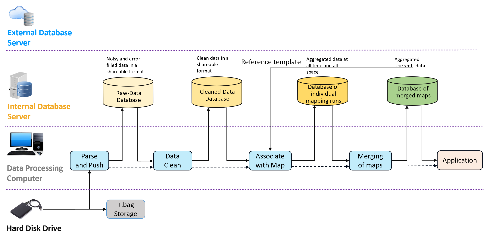
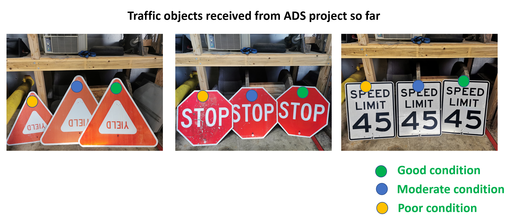
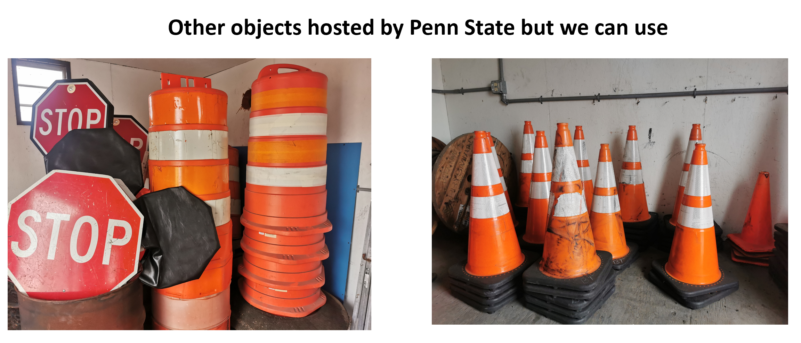

# Safe Integration of Automated Vehicles into Work Zones.
Welcome to the Penn State wiki page for details on the Automated Driving System Workzone project. This page presents details primarily focused on the Penn State team activity. Additional details can be found at the PennDOT's public ADS page, which can be found [here](https://www.penndot.gov/ProjectAndPrograms/ResearchandTesting/Autonomous%20_Vehicles/Pages/ADS-Demonstration.aspx)

# The Motivation for the Safe Integration of Automated Vehicles into Work Zones
In 2015 there were an estimated 96,626 crashes in work zones, an increase of 7.8 percent from 2014. This makes 2015 the second year in a row that work zone crashes rose after a low of 67,887 in 2013.  For comparison, in 2009 there were 667 work zone fatalities. Crashes in highway work zones have killed at least 4,700 Americans – more than two a day – and injured 200,000 in the last five years alone. There are more than 40,000 injuries in work zones each year. About 85 percent of people killed in work zones are motorists, not workers.

In Pennsylvania, the number of work zone crashes has steadily increased since 2007. Pennsylvania has also consistently appeared in the top 10 states with the most commercial motor vehicle-related work zone crashes. 

With Autonmous Vehciles being increasingly deployed to public roads, construction zones may present challenges to these vehicles, construction zone operators, and the surrounding traffic. Construction zones, by definition, are new areas with features that did not exist earlier, that are dynamic, and that may not follow typical conventions. The AV behaviors in workzones may not follow human-driven vehicle behavior, which can confuse construction zone operators that may assume human driving behavior. And as both AVs and construction environments interact with each other, the vehicles nearby the AV may also need to respond to new behaviors. Our project intends to investigate these behaviors to improve safety in and around work zones for AVs. This is achieved by increasing identification and connectivity with work zone artifacts, improving visibility by coating pavement marking and work zone artifacts, and improving mapping of work zones.

# Project Vision, Mission, Goals, and Objectives
Vision – Enable automated vehicles to safely operate in work zones without human intervention.

Mission – Reduce traffic fatalities and increase mobility for all Americans in work zones through automated vehicles.

Goals – Achieve safe navigation of automated vehicles on par with non-distracted, humanoperated automated vehicles within work zones.

Objectives of this project:
1. Evaluate the impact of improved connectivity between the AVs and the work zone artifacts using DSRC/C-V2X.
2. Evaluate the impact of increased visibility (machine vision) of pavement markings and work zone artifacts on AVs through innovative coatings
3. Evaluate the impact of providing high definition mapping of work zone artifacts (i.e. cones, barrels, workers, vehicles)
4. Improve the map information dissemination process from the mapping providers and/or infrastructure owners/operators to the AVs through standardization of digital mapping information for work zones.

# Team members (Penn State Only)
 
* Project PIs
  
  Dr. Sean Brennan  
  

 

 * Students

 Maddipatla Satya Prasad   |  Wushuang Bai             | Liming Gao                | Xinyu Cao
:-------------------------:|:-------------------------:|:-------------------------:|:-------------------------:
  |  |  |  

# Testing vehicles
* Penn State Mapping Vehicle
See [https://connectedvehicles.psu.edu/](https://connectedvehicles.psu.edu/)
 

* CMU's AV vehicle fleet
 

# Broader impacts 
The Automated Driving System Work Zone reduces abnormal vehicle behaviors improves safety by providing information to the AVs in real-time. By creating the connection between the AVs and construction environments, reliable and accurate information can be used by AVs to make decisions when approaching and driving through work zones. By investigating the behaviors resulting from these decisions, we not only can improve safety in and around work zones for AVs but also the safety of construction zone operators and other motorists. Apart from that, in combination with traffic flow in this area, these behaviors can also be used to adjust the layout of the working zone to ease congestion and inform motorists at an appropriate time and location to improve time and cost effectiveness.
# Data flow 
The data flows through sensors on the vehicle, computational systems in the vehicle, hard drives, computational systems off-vehicle, local databases/servers, cloud service, and finally goes into applications such as autonomous vehicles, vehicle simulation such as CARLA, traffic simulation such as SUMO and other end users, shown as below.

# Code repositories
Code repositories are hosted by IVSG as below.

|     Category     |     Resources                                                                                           |     Repo address                                            |
|------------------|---------------------------------------------------------------------------------------------------------|--------------------------------------------------------------------------------------------------------------------|
|     Documents    |     Mapping vehicle calibration data and   results                                                      |     https://github.com/ivsg-psu/Hardware_MappingVanHardware_ Calibration                                            |
|                  |     Mapping vehicle set up information,   such as wiring layouts, physical locations of sensors, etc    |     https://github.com/ivsg-psu/Hardware_MappingVanHardware_ HardwareSummary                                        |
|        Code      |     Code to operate sensors on mapping   vehicle                                                        |     https://github.com/ivsg-psu/FieldDataCollection_DataColl ectionProcedures_MappingVanROSNodes                    |
|                  |     Code to parse raw data to raw data   database                                                       |     https://github.com/ivsg-psu/FieldDataCollection_DataColl ectionProcedures_ParseRawDataToDatabase                |
|                  |     Code to clean raw data and push into   cleaned-data database                                        |     https://github.com/ivsg-psu/FeatureExtraction_LaneDetect ion_LIDAR_Reflectivity_And_Geometry_Lane_Extraction    |
|                  |     Code to associate cleaned data with   map(WIP)                                                      |     https://github.com/ivsg-psu/FieldDataCollection_DataColl ectionProcedures_MapAssociation                        |
|                  |     Code to merge individual maps(WIP)                                                                  |     https://github.com/ivsg-psu/FieldDataCollection_DataColl ectionProcedures_MapMerge                              |

# Equipment inventory
We have received traffic objects from PennDOT as below.

We also have traffic objects hosted by Penn State that we can use on test track.

# Groups with related interests
Please see links below for other research groups with related interests:
<ul>
<li>
 <a href = "https://ctre.iastate.edu/roadway-information-database-rid/">
  SHRP 2 WEBINAR: SHRP 2 Roadway Information Database (RID): Doing Research without NDS data
 </a>
</li>
</ul>

# Funding
This project is funded by USDOT via Pennsylvania Department of Transportation under NOFO # 693JJ319NF00001.

